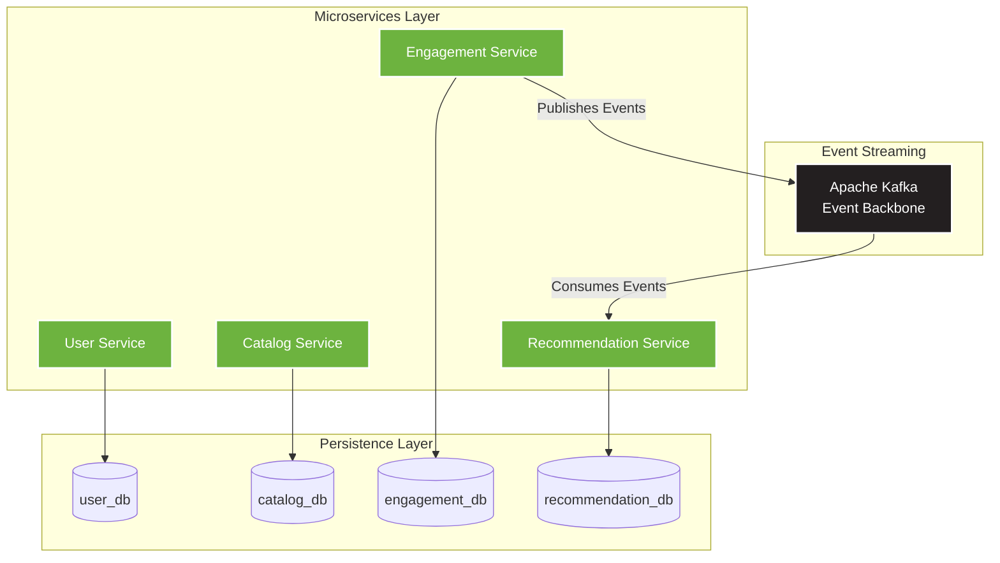

# 🎬 Media Recommendation System

> A next-generation, event-driven media recommendation platform inspired by Netflix and Spotify, built with microservices architecture.

[](https://www.docker.com/)
[](https://www.postgresql.org/)
[](https://kafka.apache.org/)
[](https://spring.io/projects/spring-boot)

## 🚀 Overview

The **Media Recommendation System** is a scalable, distributed application designed to deliver personalized content recommendations to users in real-time. By leveraging an **event-driven architecture**, the system ensures seamless communication between microservices through **Apache Kafka**, enabling asynchronous data processing and real-time analytics.

### 🏗️ Architecture

The system follows a **microservices architecture** with event-driven communication. Each microservice follows the **Database per Service** pattern, ensuring complete isolation and independent scalability.



**Key Components:**
- 🔐 **User Service** → `user_db`: Manages user authentication, profiles, and preferences
- 📚 **Catalog Service** → `catalog_db`: Maintains the catalog of movies, series, and metadata
- 💡 **Engagement Service** → `engagement_db`: Tracks user interactions (views, likes, clicks, ratings) and publishes events to Kafka
- 🎯 **Recommendation Service** ← Kafka → `recommendation_db`: Consumes engagement events and generates personalized recommendations
- 🤖 **ML Service** (Python): Provides intelligent recommendations using hybrid algorithm (collaborative + content-based filtering)
- 📨 **Apache Kafka**: Acts as the central event bus for asynchronous communication between services

> **📝 Local Development Note**: For simplified local development with Docker Compose, all four databases (`user_db`, `catalog_db`, `engagement_db`, `recommendation_db`) are hosted within a single PostgreSQL 15 container. This approach maintains logical database separation while reducing infrastructure complexity in the development environment. In production, each database would be deployed as an independent instance to ensure complete service isolation.

## 🤖 ML Service - Personalized Recommendations

The **ML Service** is a Python-based microservice that delivers personalized media recommendations using a sophisticated hybrid algorithm:

### Algorithm Features
- **Content-Based Filtering (40%)**: Matches media to user's genre preferences
- **Collaborative Filtering (60%)**: Recommends based on similar users' behavior
- **Performance Optimized**: Connection pooling, batch queries, avoiding N+1 problems
- **Scalable**: Horizontally scalable with Gunicorn multi-worker support

### Quick Start
```bash
# Get recommendations for a user
curl "http://localhost:5000/api/recommendations/USER_UUID?limit=10"

# Check service health
curl http://localhost:5000/health
```

📖 **Full Documentation**: See [ML Service Integration Guide](ml-service/INTEGRATION_GUIDE.md)

## 📦 Technology Stack

| Component | Technology | Version |
|-----------|-----------|---------|
| **Containerization** | Docker & Docker Compose | Latest |
| **Database** | PostgreSQL | 15 |
| **Message Broker** | Apache Kafka | 7.3.0 (Confluent) |
| **Coordination** | Apache Zookeeper | 7.3.0 (Confluent) |
| **Backend Services** | Spring Boot (Java) | 4.0.0 |
| **ML Service** | Python + Flask | 3.11+ / 3.0.0 |
| **JDK** | Java | 21 |

## 🗄️ Database Architecture

The system follows the **Database per Service** pattern, a core principle of microservices architecture that ensures:
- ✅ **Service Isolation**: Each microservice owns its data and schema
- ✅ **Independent Scalability**: Databases can be scaled independently based on service needs
- ✅ **Technology Flexibility**: Each service can choose the optimal database technology
- ✅ **Fault Isolation**: Database issues in one service don't cascade to others

| Database | Owner Service | Purpose |
|----------|---------------|---------|
| `user_db` | User Service | User management and authentication |
| `catalog_db` | Catalog Service | Media catalog and metadata |
| `engagement_db` | Engagement Service | User interaction tracking (views, likes, clicks) |
| `recommendation_db` | Recommendation Service | Recommendation results and cache |

> 💡 **Auto-Initialization**: All databases are automatically created during the first startup via the `./scripts/create-databases.sql` initialization script.

> 🏗️ **Local Development Setup**: For the local Docker Compose environment, all four databases run within a single PostgreSQL 15 container instance. This simplified approach maintains logical separation while reducing resource overhead for development. In production deployments, each database would be provisioned as a separate instance to achieve full physical isolation.

## ⚙️ Prerequisites

Before running the project, ensure you have the following installed:

- 🐳 **Docker**: [Install Docker](https://docs.docker.com/get-docker/)
- 🐙 **Docker Compose**: [Install Docker Compose](https://docs.docker.com/compose/install/)

Verify your installations:
```bash
docker --version
docker-compose --version
```

## 🚀 Getting Started

### Quick Start

1. **Clone the repository**:
   ```bash
   git clone https://github.com/Luca5Eckert/media-recommendation-system.git
   cd media-recommendation-system
   ```

2. **Start the infrastructure**:
   ```bash
   docker-compose up -d
   ```

3. **Verify the services are running**:
   ```bash
   docker-compose ps
   ```

That's it! 🎉 The infrastructure is now running with:
- ✅ PostgreSQL with 4 databases automatically initialized
- ✅ Apache Kafka ready for event streaming
- ✅ Zookeeper managing Kafka coordination

### 📂 Auto-Initialization

The `./scripts/create-databases.sql` file contains SQL commands to create all required databases. This script is automatically executed when PostgreSQL starts for the first time, thanks to Docker's `docker-entrypoint-initdb.d` mechanism.

## 🔧 Useful Commands

### Docker Management

**View all running containers:**
```bash
docker-compose ps
```

**Stop all services:**
```bash
docker-compose down
```

**Restart services:**
```bash
docker-compose restart
```

**Remove volumes (⚠️ deletes all data):**
```bash
docker-compose down -v
```

### Database Access

**View PostgreSQL logs:**
```bash
docker logs media-db
```

**Access PostgreSQL CLI:**
```bash
docker exec -it media-db psql -U user -d user_db
```

**List all databases:**
```bash
docker exec -it media-db psql -U user -d user_db -c "\l"
```

**Connect to a specific database:**
```bash
docker exec -it media-db psql -U user -d catalog_db
```

### Kafka Management

**View Kafka logs:**
```bash
docker logs kafka
```

**List Kafka topics:**
```bash
docker exec -it kafka kafka-topics --list --bootstrap-server localhost:9092
```

**Create a new topic:**
```bash
docker exec -it kafka kafka-topics --create --topic engagement-events --bootstrap-server localhost:9092 --partitions 3 --replication-factor 1
```

## 🌐 Service Ports

| Service | Port | Access |
|---------|------|--------|
| PostgreSQL | `5432` | `localhost:5432` |
| Apache Kafka | `9092` | `localhost:9092` |
| Zookeeper | `2181` | `localhost:2181` |
| User Service | `8084` | `http://localhost:8084` |
| Catalog Service | `8081` | `http://localhost:8081` |
| Engagement Service | `8083` | `http://localhost:8083` |
| Recommendation Service | `8085` | `http://localhost:8085` |
| **ML Service** | `5000` | `http://localhost:5000` |

### Database Connection Details

```
Host: localhost
Port: 5432
User: user
Password: password
Databases: user_db, catalog_db, engagement_db, recommendation_db
```

## 📈 Project Status

🚧 **This project is currently in MVP/Infrastructure Setup phase**

### ✅ Completed
- [x] Docker Compose configuration
- [x] PostgreSQL setup with multi-database architecture
- [x] Apache Kafka and Zookeeper integration
- [x] Database auto-initialization scripts
- [x] Microservices project structure (catalog-service, engagement-service, user-service)
- [x] **ML Service with hybrid recommendation algorithm (Python/Flask)**

### 🛣️ Roadmap / Next Steps

1. **Microservices Implementation**
   - [ ] Complete User Service (Authentication & Authorization)
   - [ ] Complete Catalog Service (Media CRUD operations)
   - [ ] Complete Engagement Service (Event publishing to Kafka)
   - [ ] Implement Recommendation Engine (Kafka consumer + ML algorithms)

2. **API Layer**
   - [x] RESTful API for ML recommendations
   - [ ] API Gateway for unified access
   - [ ] OpenAPI/Swagger documentation

3. **Event Streaming**
   - [ ] Define Kafka topic schemas (Avro/JSON)
   - [ ] Implement producers and consumers
   - [ ] Event sourcing patterns

4. **Machine Learning**
   - [x] Collaborative filtering algorithms
   - [x] Content-based filtering
   - [x] Hybrid recommendation strategies
   - [ ] Model training pipeline
   - [ ] Real-time learning from user feedback

5. **Frontend**
   - [ ] Web application (React/Vue/Angular)
   - [ ] Mobile applications (React Native/Flutter)

6. **DevOps & Production**
   - [ ] CI/CD pipelines
   - [ ] Kubernetes orchestration
   - [ ] Monitoring and observability (Prometheus, Grafana)
   - [ ] Distributed tracing (Jaeger/Zipkin)

## 🤝 Contributing

Contributions are welcome! Please feel free to submit a Pull Request.

## 📄 License

This project is licensed under the MIT License.

## 📧 Contact

For questions or suggestions, please open an issue in the repository.

---

⭐ **If you find this project useful, please consider giving it a star!** ⭐
